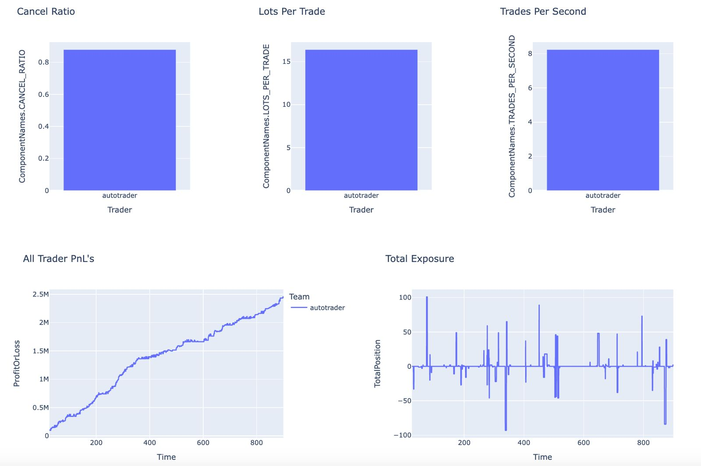
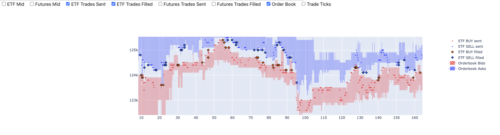

## Description
Ready Trader Go is an algorithmic market making competition hosted by Optiver. 
It involves market making an illiquid ETF market, with the help of a deep futures market.

---
## Code
I used the C++ version of the challenge to build my trader. All code included in this repo was written by your truly.
Below is a screenshot of my traders activity and PNL.

---
## Analysis
I have also attached a sample of the data analysis I carried out to develop this trader. 
The dashboard.py application is browser-based dashboard I wrote to analyse my traders performance.
It can be called via the command line, or directly via importing it.

